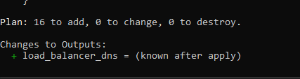

# CredPal DevOps Assessment

## Project Overview
A production-ready Node.js REST API built with Express and Redis, featuring 
a fully automated CI/CD pipeline via GitHub Actions, Docker containerization, 
and AWS infrastructure provisioned with Terraform.

## Endpoints
| Method | Route      | Description              |
|--------|------------|--------------------------|
| GET    | /health    | Returns app health status |
| GET    | /status    | Returns environment info  |
| POST   | /process   | Processes submitted data  |

## Prerequisites
- Node.js >= 18
- Docker & Docker Compose
- Terraform >= 1.0
- AWS CLI (for infrastructure deployment)
- A DockerHub account

---

## Running Locally (without Docker)
```bash
# Install dependencies
npm install

# Run tests
npm test

# Start the app
npm start
```
App runs at: `http://localhost:3000`

---

## Running with Docker
```bash
# Copy environment variables
cp .env.example .env

# Build and start all services (app + Redis)
docker-compose up --build

# Stop services
docker-compose down

# Stop and remove volumes
docker-compose down -v
```
App runs at: `http://localhost:3000`

---

## CI/CD Pipeline (GitHub Actions)

Pipeline triggers on:
- Push to `main`
- Pull requests to `main`

### Jobs:
1. **build** — installs dependencies and runs tests
2. **build-and-push** — builds Docker image and pushes to DockerHub
   (only runs on push to main, not on pull requests)

### Required GitHub Secrets:
| Secret | Description |
|--------|-------------|
| `DOCKER_USERNAME` | Your DockerHub username |
| `DOCKER_PASSWORD` | Your DockerHub password or access token |

---

## Infrastructure (Terraform)

### Prerequisites
- AWS CLI configured with credentials
- A registered domain name pointed to AWS Route 53(for SSL certificate DNS validation)

Provisions the following on AWS:
- VPC with 2 public subnets across availability zones
- Internet Gateway and Route Table
- Security Groups (ALB and EC2 separated)
- EC2 instance running the Docker container
- Application Load Balancer with health checks
- HTTPS listener with SSL certificate (ACM)
- HTTP → HTTPS redirect

### Deploy infrastructure:
```bash
cd terraform

terraform init
terraform plan -var="domain_name=yourdomain.com" \
               -var="docker_image=bookie212/credpal-app:latest"
terraform apply
```

> **Note:** After apply, add the CNAME record shown in AWS Certificate Manager 
> to your domain's DNS settings for SSL validation to complete.
> Replace `app.example.com` in `variables.tf` with your actual 
> domain before applying. SSL validation requires a real domain with 
> DNS access.

---

## Security Decisions

| Decision | Implementation |
|----------|---------------|
| No secrets in code | All secrets stored in GitHub Secrets and `.env` (gitignored) |
| Non-root container | App runs as `appuser` inside Docker container |
| EC2 not publicly accessible | EC2 security group only accepts traffic from ALB |
| HTTPS enforced | HTTP (port 80) permanently redirects to HTTPS (443) |
| TLS 1.3 | ALB configured with latest TLS security policy |
| Image pinned | Redis pinned to `redis:7-alpine`, Node to `node:18-alpine` |

---

## Key Design Decisions

- **Multi-stage Dockerfile** — builder stage installs all deps; production stage 
  only copies what's needed, keeping the image lean and secure
- **Two CI jobs** — tests run first; Docker image only builds and pushes if 
  tests pass, preventing broken images reaching DockerHub
- **Redis over PostgreSQL** — lightweight, fits the scope of the assessment, 
  and demonstrates service orchestration with health checks
- **ALB health checks hit `/health`** — ensures the load balancer only routes 
  traffic to a healthy instance
- **Rolling deployment** — `--restart unless-stopped` on Docker ensures 
  zero-downtime recovery from crashes

## Terraform Plan Output
Terraform was validated locally with `terraform plan` — 
16 resources planned with 0 errors.

